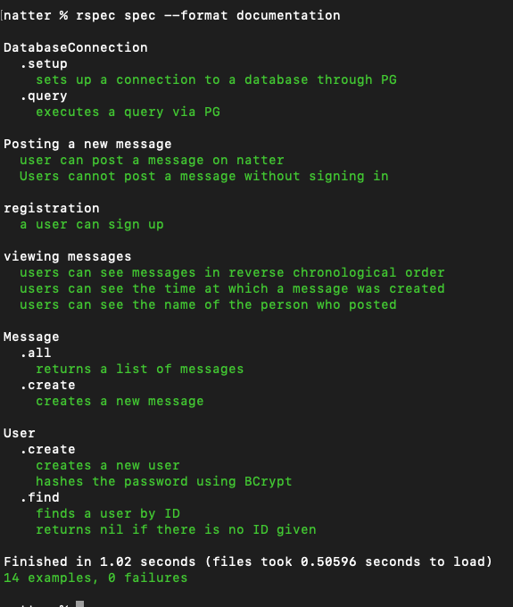

# Chitter challenge

```
                                              ////                              
                /                        //////////////   ///                   
               *////                   ////////////////////                     
               ////////               ///////////////////////                   
                ///////////.          ////////////////////.                     
                 ///////////////////* ////////////////////                      
               //  ///////////////////////////////////////                      
                //////////////////////////////////////////                      
                 ////////////////////////////////////////                       
                   /////////////////////////////////////                        
                   * ./////////////////////////////////                         
                    //////////////////////////////////                          
                      //////////////////////////////                            
                            //////////////////////                              
                        ///////////////////////                                 
               ////////////////////////////.                                    
                     ////////////////, 
```

 # Introduction

This is my solution to the Makers fourth weekend challenge where the objective is to design a simple Twitter clone. The app is called Natter and allows users to post peeps.

The solution builds on my learnings from the week around how to create a simple web app linked to a PSQL database. This solution also includes feature such as flash messages and user login.

My solution:

- built entirely through TDD 
- all RSpec tests passing
- uses a PSQL database to save both users and peeps
- uses BCrpyt to secure the password provided by the user 
- use of database and test helpers to make code DRY

## How to use

#### To set up the project

Clone this repo and then run 

```
bundle install
```

#### To set up the database

Connect to `psql` and create the `natter` and `natter_test` databases:

```
CREATE DATABASE natter;
CREATE DATABASE natter_test;
```
To set up the appropriate tables, connect to each database in `psql` and run the SQL scripts in the `db/migrations` folder in the given order.

#### To run the Chitter app

In the command line, navigate to the root folder and run Rack with the following command:

```
rackup 
```

To view peeps, navigate to `localhost:9292/messages` in you r web browser.

#### To run tests:

In the command line, navigate to the root folder and run RSpec with the following command:

```
rspec
```

The following is a screenshot of the test output:



## User stories 

The following user stories were implemented as part of this project:

```
As a Maker
So that I can let people know what I am doing  
I want to post a message (peep) to chitter

As a maker
So that I can see what others are saying  
I want to see all peeps in reverse chronological order

As a Maker
So that I can better appreciate the context of a peep
I want to see the time at which it was made

As a Maker
So that I can post messages on Chitter as me
I want to sign up for Chitter
```

## Improvements

Time permitting, I would like to have worked on the following:
- implement login and logout functionality 
- linking the message and user databases with a common user full_name
- improving the styling of the views
- testing edge cases 
- implementing a character limit for messages e.g. 140 characters 

Original project page [here](https://github.com/makersacademy/chitter-challenge)